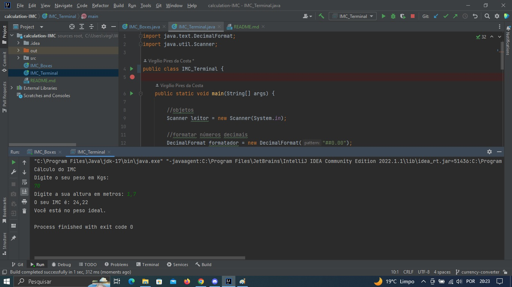
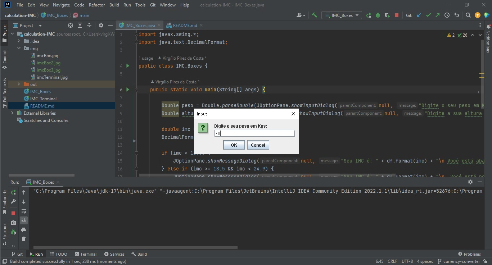
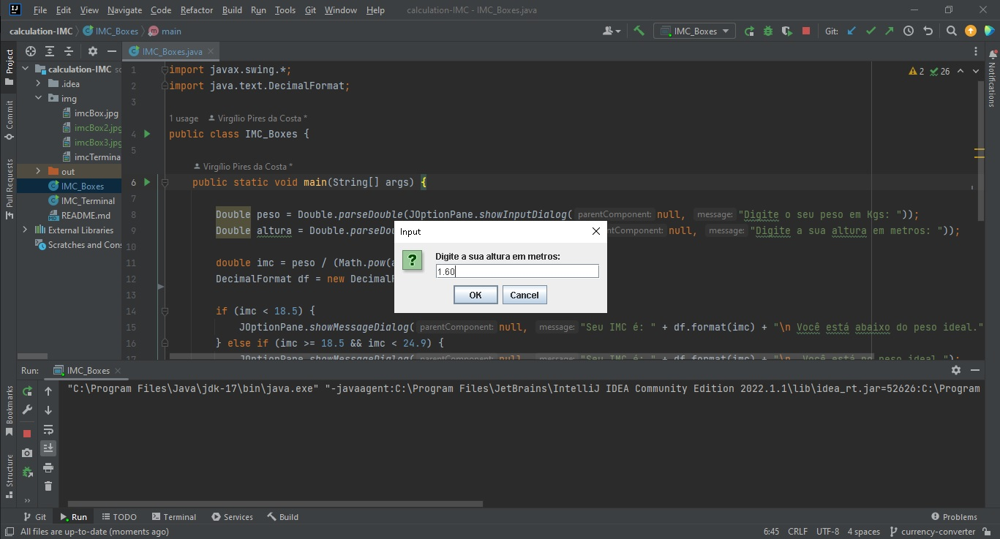
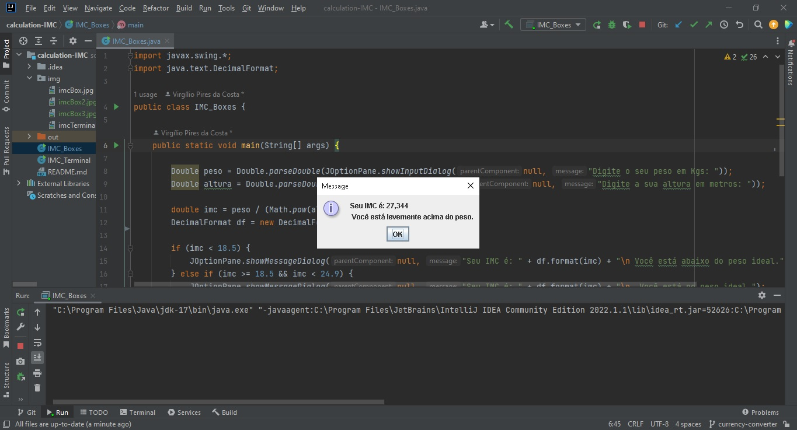

    
    
    
    

# Cálculo de IMC 💇

## :information_source: Sobre

Esse foi um projeto desenvolvido durante a mentoria Conquiste a Sua Vaga!

## :seedling: O projeto <strong>Cálculo IMC</strong> possui:
<ul>
  <li>Campos para preenchimento de peso e altura no terminal na sua versão IMC_Terminal;</li>
  <li>E caixas para inserir informações de peso(exemplo: 70 e altura (exemplo: 1.70) na sua versão IMC_Boxes;</li>  
</ul>

## :seedling: O resultado <strong>do cálculo</strong> apresenta:
<ul>
  <li>Informações sobre o IMC conforme OMS;</li>
  <li>Alertando ao usuário sobre os graus de obesidade;</li>  
</ul>

## :seedling: Requisitos Mínimos

Vontade de aprender.

# :rocket: Material de Referência e Tecnologias Utilizadas

O projeto foi desenvolvido utilizando as seguintes tecnologias

- Java.

## 🚀 Let's code! 🚀